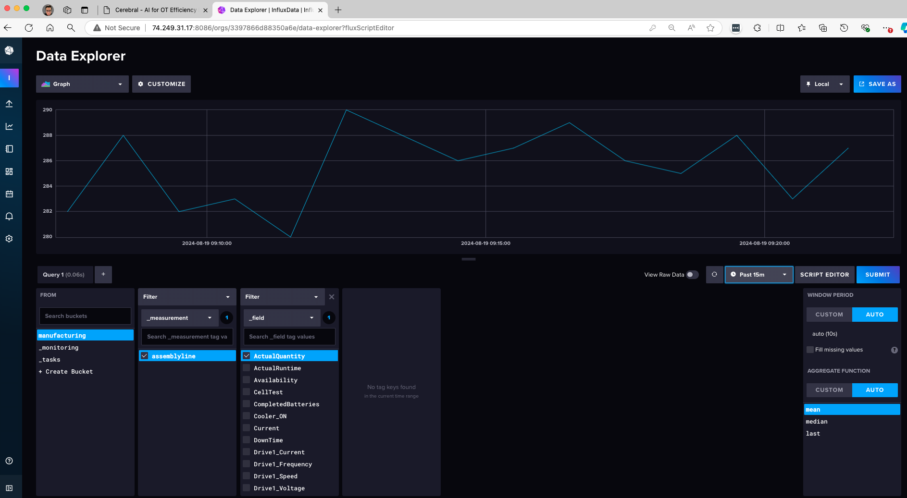

# Cerebral – Micorosoft Global Hackathon 2024

## Introduction

The "Cerebral" Micorosoft Global Hackathon 2024 team has laid the foundation for the next generation of the Cerebral solution, an intelligent assistant at the edge that utilizes Generative AI and various [Adaptive cloud approach](https://azure.microsoft.com/blog/advancing-hybrid-cloud-to-adaptive-cloud-with-azure/) and services. This innovative solution is designed to simplify tasks for different roles across industries such as Retail, Logistics, and Manufacturing.

### Demo overview

Cerebral serves as the central intelligence engine that interacts with different personas, showcasing how it assists in various scenarios. By integrating seamlessly across different roles, Cerebral demonstrates its multi-industry, multi-role capabilities, making it a powerful AI assistant for enhancing operational workflows, decision-making processes, and cross-functional collaboration in diverse industries.


- **Retail (Lisa)**: As a store manager, Lisa relies on Cerebral to monitor inventory levels. When Cerebral detects low stock for certain products, it proactively alerts Lisa and helps her pre-fill the order form with the required quantities. This feature saves Lisa time and ensures that the store is always well-stocked, preventing potential sales losses due to out-of-stock items.

- **Logistics (Mark)**: As a warehouse supervisor, Mark uses Cerebral to stay informed about operational issues. In this case, Cerebral detects a problem with a sensor indicating a broken fridge that could lead to a shortage of products (e.g., 10 boxes of cheese). Cerebral notifies Mark about this issue and helps him by pre-filling the service order form. This ensures that Mark can quickly respond to maintenance needs and avoid further product losses, maintaining the warehouse's efficiency.

- **Manufacturing (Tom)**: As an operations technician (OT), Tom benefits from Cerebral's ability to provide step-by-step troubleshooting guidance. Tom can consult Cerebral for documentation and even ask natural language questions to understand how to resolve complex problems, such as fixing an issue with a production machine or addressing food safety concerns. For example, if there's an electricity issue affecting the salmon production line, Cerebral helps guide Tom through the process of identifying and fixing the problem, reducing downtime and ensuring product quality.

[](https://youtu.be/aVWu089dqdI)

### Key objectives

The work done during the hackathon has focused on the following pillars:

- **Expand Cerebral for Multi-Industry and Multi-Role Use**: Make Cerebral capable of supporting various industries and roles, adapting to different requirements and workflows.
- **Enhance User Experience and Graphical Interface**: Improve the user interface and overall user experience to make interactions more intuitive and efficient.
- **Enable Proactive Notifications**: Implement a proactive notification module based on the most critical components of each business.
- **Decouple the Frontend from the Backend**: Separate the graphical interface from the backend to enhance flexibility and scalability.
- **Expand Real-Time Data Capabilities**: Extend the ability to access real-time data not only from time-series databases but also by converting natural language questions into queries for relational databases.
- **Maintain a Hybrid Model**: Provide the option to choose between using Azure OpenAI or leveraging the PHI-3 model and a vector database at the edge.
- **Automate Infrastructure Creation as Code**: Implement infrastructure automation using Bicep to streamline the deployment and management process, ensuring that all components are deployed efficiently and consistently across different environments.

## Cerebral architecture overview

The architecture of Cerebral is designed to facilitate seamless integration and real-time interaction across various components, making it a versatile solution for different industrial scenarios.


### Key components

1. **Cerebral Engine**:
   The Cerebral Engine is composed of several logical layers, each playing a vital role in the overall architecture. It integrates seamlessly with different components to provide a flexible and adaptive AI-driven experience. The web application is developed in **ReactJS**, allowing it to adapt to multiple scenarios and user requirements across various industries.

   - **React JS Web Application**: This is the user interface layer that offers an intuitive and user-friendly graphical experience. It enables users to interact with Cerebral's capabilities, presenting data and insights in an accessible format. The use of ReactJS makes the application highly adaptable, capable of supporting various workflows and scenarios.

   - **REST API Query Processing Orchestrator**: The REST API layer acts as the main communication hub, managing incoming queries and orchestrating data retrieval from multiple sources. It serves as a gateway that allows Cerebral’s functionalities to be accessed through REST APIs, providing the flexibility to embed Cerebral in different processes and making it agnostic to any graphical interface. This approach enables integration with other systems or applications, enhancing Cerebral's interoperability.

   - **Proactive Recommendation and Alerts Engine**: This component provides proactive alerts and recommendations based on predefined rules or AI insights. It continuously monitors the conditions within databases and generates alerts for critical scenarios. Users can configure natural language questions that the engine converts into queries for time-series or relational databases, enabling analysis of the most critical aspects of their business. This ensures that users are always informed about potential issues or opportunities, helping them make data-driven decisions.

   - **RAG (Retrieval Augmented Generation) at the Edge**: This module utilizes Chroma vector databases along with SLM/LLM models (such as Phi-3) to deliver intelligent responses. The design pattern of Retrieval Augmented Generation (RAG) allows users to work in environments with limited or no internet connectivity while still benefiting from AI capabilities. This enables the deployment of advanced generative AI models at the edge, ensuring low latency and minimal dependence on cloud connectivity.

   - **Database Connectors**: The database connectors facilitate seamless integration with various databases, including InfluxDB, MSSQL Lite, and custom solutions. Cerebral's ability to convert natural language questions into database queries means that users can interact with their data in a more intuitive way. This allows non-technical users to extract insights from time-series or relational databases without needing to understand complex query languages.

2. **Data Sources**:
   Cerebral’s REST API has the capability to analyze natural language questions posed by users and determine whether they relate to real-time data or document/manual-based information. When the question is identified as related to real-time data, the API consults the appropriate data sources, such as InfluxDB for time-series data or SQLite for relational data.

   - **InfluxDB**: InfluxDB handles telemetry data from various assets, providing near real-time insights. This data source is ideal for monitoring sensor data, allowing users to keep track of asset conditions and operational metrics.

   - **SQLite**: SQLite serves as the storage for point-of-sale (POS) and inventory data, enabling relational queries. This data source is critical for accessing structured data related to products, transactions, and inventory levels within a data warehouse.

   - **Data Simulator**: The data simulator generates both time-series and relational data, providing a testing environment for the Cerebral system. This ensures that users can validate their use cases and workflows in a controlled setting before deploying the solution in a live environment.

3. **Azure IoT Operations**:
   Cerebral leverages the capabilities of [Azure IoT Operations](https://learn.microsoft.com/azure/iot-operations/overview-iot-operations) to facilitate data communication and processing at the edge. It utilizes the MQTT broker as part of the logic for the Retrieval Augmented Generation (RAG) process, ensuring efficient data flow at the edge. Additionally, Azure IoT Operations data flow connectors are employed to transmit data to Azure's data services.

   - **MQTT Broker & Data Flow**: The MQTT broker collects and manages data from IoT devices, enabling seamless integration with edge-based systems. This enhances Cerebral’s ability to handle data from a wide range of industrial IoT sensors and devices, supporting real-time decision-making processes.

4. **Azure Cognitive Services & OpenAI**:
   These services enhance Cerebral’s capabilities by providing advanced AI functionalities.

   - **Speech-to-Text & AI-Powered Contextualization**: Azure Cognitive Services offer speech-to-text capabilities, enabling users to interact with Cerebral using voice commands. Additionally, Azure OpenAI provides AI-powered data contextualization and query classification, allowing users to ask complex questions in natural language and receive intelligent responses.

5. **PowerBI Dashboards & Azure Data Factory**:
   These components provide visualization and data orchestration capabilities that are essential for monitoring and analyzing business operations.

   - **Data Visualization & Insights**: PowerBI Dashboards allow users to visualize data, making it easier to monitor key performance indicators (KPIs) and gain actionable insights. Azure Data Factory acts as the data orchestration service, enabling the movement and transformation of data from various sources into the dashboard for comprehensive analysis.

## Decision tree architecture

The decision tree architecture of Cerebral illustrates how different data types and queries are handled to provide relevant insights and recommendations.


### Execution flow

Cerebral uses a bi-directional query workflow to handle various use cases:

- **Proactive Alerts**: Triggers alerts based on inventory shortages, operational outages, or equipment state.
- **Work Item Prepopulation**: Assists in creating work orders or maintenance requests.
- **Error Summarization**: Provides summaries of operational errors and suggests troubleshooting steps.

Queries are classified into three main types:

- **Near Real-Time Data**: InfluxDB queries are executed to retrieve time-series data.
- **Relational-Based Data**: Queries are converted into SQLite queries to fetch necessary data.
- **OpenAI RAG-Based Queries**: The query is sent to the backend, where the vector database and LLM are used to generate a comprehensive response.

## How to use Cerebral

Cerebral offers a versatile solution designed to support various roles:

- **Store Managers**: Can use Cerebral to monitor inventory levels and address shortages.
- **Logistics Managers**: Utilize Cerebral to manage equipment status and streamline work orders.
- **Operations Managers**: Benefit from error summaries and troubleshooting support to ensure operational efficiency.

Cerebral’s multi-industry, multi-role capabilities make it a powerful assistant that integrates AI into day-to-day operations seamlessly.

## Getting started

Follow these steps to set up and use Cerebral in your environment:

1. **Deploy the Backend**: Set up the Cerebral backend components on an edge-located, Arc-enabled Kubernetes cluster.
2. **Connect Data Sources**: Integrate InfluxDB, SQLite, and other required data sources.
3. **Configure the Frontend**: Deploy the React JS web application and connect it to the backend using the provided APIs.
4. **Enable Proactive Alerts**: Configure the proactive alert engine to monitor critical business components.

## Prerequisites

Before deploying Cerebral, several pre-requisites must be fulfilled to ensure a successful installation and operation. The system is designed to run on both virtual machines and physical servers that can handle edge computing tasks effectively.

### Hardware requirements

1. **Linux-Based System**: Cerebral requires a Linux-based system, specifically a VM or physical machine running **Linux Ubuntu 22.04**. This system will perform as an edge server, handling queries directly from the production line and interfacing with other operational systems.

2. **Resource Specifications**:
   - **Minimal Resource Deployment**: For deployments using the Language Learning Model (LLM) hosted on Azure, a lighter resource footprint is feasible. A machine with at least **16 GB RAM and 4 CPU cores** should suffice.
   - **Full Resource Deployment**: For on-premises deployments where the System Lifecycle Management (SLM) is also located on-premises, a more robust system is required. It's recommended to use an Azure VM configured to simulate an edge environment with **32 GB RAM and 8 CPU cores**.

### Software requirements

- **Azure CLI**: Essential for interacting with Azure services.
- **Rancher K3s**: Lightweight Kubernetes distribution suitable for edge computing environments.
- **Curl**: Tool to transfer data from or to a server, used during various installation steps.

### Network requirements

To ensure smooth communication and operation of the Cerebral, specific network configurations are necessary. These configurations cater to the infrastructure's hybrid nature, leveraging both Azure services and on-premises components.

#### Azure Arc-enabled Kubernetes

Cerebral utilizes [Azure Arc-enabled Kubernetes](https://docs.microsoft.com/azure/azure-arc/kubernetes/overview) to extend Azure management capabilities to Kubernetes clusters anywhere. This integration allows for the management of Kubernetes clusters across on-premises, edge, and multi-cloud environments through Azure's control plane.

#### Control Plane

The control plane of Cerebral, managed through Azure Arc, requires network configurations that adhere to Azure Arc's [networking requirements](https://docs.microsoft.com/azure/azure-arc/kubernetes/network-requirements). It's crucial to ensure that all necessary ports and endpoints are accessible to facilitate command and control operations seamlessly.

#### Data Plane

For the data plane, which handles the direct processing and movement of operational data:

- **Port 443 (HTTPS)**: This port is used predominantly to secure data transmission across the network, ensuring encrypted communication for all data exchanges between the edge devices and the centralized data services.

## Deployemnt steps

### Step 1 - Building an Ubuntu VM running Azure IoT Operations

#### Prepare your Azure Arc-enabled Kubernetes cluster on Ubuntu

- Install `curl`:

```bash
sudo apt install curl -y
```

- Install Azure CLI:

```bash
curl -sL https://aka.ms/InstallAzureCLIDeb | sudo bash
```

- Install Azure IoT Operations cluster extension:
  
```bash
az extension add --upgrade --name azure-iot-ops
```

- Install Rancher K3s:

```bash
curl -sfL https://get.k3s.io | sh –
```

#### Setup K3s configuration

- Create K3s configuration:

```bash
mkdir ~/.kube
sudo KUBECONFIG=~/.kube/config:/etc/rancher/k3s/k3s.yaml kubectl config view --flatten > ~/.kube/merged
mv ~/.kube/merged ~/.kube/config
chmod  0600 ~/.kube/config
export KUBECONFIG=~/.kube/config
kubectl config use-context default
```

- Increase user watch/instance limits:

```bash
echo fs.inotify.max_user_instances=8192 | sudo tee -a /etc/sysctl.conf
echo fs.inotify.max_user_watches=524288 | sudo tee -a /etc/sysctl.conf
sudo sysctl -p
```

- Increase file descriptor limit:

```bash
echo fs.file-max = 100000 | sudo tee -a /etc/sysctl.conf
sudo sysctl -p
```

#### Connect your cluster to Azure Arc

- Login to Azure:

```bash
az login
```

- Set environment variables:
  
```bash
export SUBSCRIPTION_ID=<YOUR_SUBSCRIPTION_ID>
export LOCATION=<YOUR_REGION>
export RESOURCE_GROUP=<YOUR_RESOURCE_GROUP>
export CLUSTER_NAME=<YOUR_CLUSTER_NAME>
export KV_NAME=<YOUR_KEY_VAULT_NAME>
export INSTANCE_NAME=<YOUR_INSTANCE_NAME>
```

- Set Azure subscription context:

```bash
az account set -s $SUBSCRIPTION_ID
```

- Register required resource providers:
  
```bash
az provider register -n "Microsoft.ExtendedLocation"
az provider register -n "Microsoft.Kubernetes"
az provider register -n "Microsoft.KubernetesConfiguration"
az provider register -n "Microsoft.IoTOperationsOrchestrator"
az provider register -n "Microsoft.IoTOperations"
az provider register -n "Microsoft.DeviceRegistry"
```

- Create a resource group:

```bash
az group create --location $LOCATION --resource-group $RESOURCE_GROUP --subscription $SUBSCRIPTION_ID
```

- Connect Kubernetes cluster to Azure Arc:

```bash
az connectedk8s connect -n $CLUSTER_NAME -l $LOCATION -g $RESOURCE_GROUP --subscription $SUBSCRIPTION_ID
```

- Get `objectId` of Microsoft Entra ID application:

```bash
export OBJECT_ID=$(az ad sp show --id bc313c14-388c-4e7d-a58e-70017303ee3b --query id -o tsv)
```

- Enable custom location support:

```bash
az connectedk8s enable-features -n $CLUSTER_NAME -g $RESOURCE_GROUP --custom-locations-oid $OBJECT_ID --features cluster-connect custom-locations
```

- Verify cluster readiness for Azure IoT Operations:

```bash
az iot ops verify-host
```

- Create an Azure Key Vault:

```bash
az keyvault create --enable-rbac-authorization false --name $KV_NAME --resource-group $RESOURCE_GROUP
```

### Step 2 - Install Cerebral

#### Deploy Namespace, InfluxDB, Simulator, and Redis

- Create a folder for Cerebral configuration files:

```bash
mkdir cerebral
cd cerebral
```

- Apply the Cerebral namespace:

```bash
kubectl apply -f https://raw.githubusercontent.com/Azure/jumpstart-cerebral/refs/heads/main/deployment/cerebral-ns.yaml
```

- Create a directory for persistent InfluxDB data:

```bash
sudo mkdir /var/lib/influxdb2
sudo chmod 777 /var/lib/influxdb2
```

- Deploy InfluxDB:

```bash
kubectl apply -f https://raw.githubusercontent.com/Azure/jumpstart-cerebral/refs/heads/main/deployment/influxdb.yaml
```

- Configure InfluxDB:

```bash
kubectl apply -f https://raw.githubusercontent.com/Azure/jumpstart-cerebral/refs/heads/main/deployment/influxdb-setup.yaml
```

- Deploy the data simulator:

```bash
kubectl apply -f https://raw.githubusercontent.com/Azure/jumpstart-cerebral/refs/heads/main/deployment/cerebral-simulator.yaml
```

- Deploy SQL Server Lite:

```bash
kubectl apply -f https://raw.githubusercontent.com/Azure/jumpstart-cerebral/refs/heads/main/deployment/mssql.yaml
```

- Configure SQL Server Lite:

```bash
kubectl apply -f https://raw.githubusercontent.com/Azure/jumpstart-cerebral/refs/heads/main/deployment/mssql-setup.yaml
```

- Validate the implementation:

```bash
kubectl get all -n cerebral
```

#### Access InfluxDB

Use a web browser to connect to the Server IP of the InfluxDB service to access its interface, for example `http://<IP_Server>:8086`

Validate that there is a bucket named `manufacturing` and that it contains a measurement called `assemblyline` with values.

To access to Grafana use the `admin` and the password of `ArcPassword123!!`



#### Install Redis

- Deploy Redis to store user sessions and conversation history:

```bash
kubectl apply -f https://raw.githubusercontent.com/Azure/jumpstart-cerebral/refs/heads/main/deployment/redis.yaml
```

#### Deploy the Cerebral application:**

- Create an Azure OpenAI service in your subscription and obtain the key and endpoint for use in the application configuration.

- Download the Cerebral application deployment file:

```bash
wget https://raw.githubusercontent.com/Azure/jumpstart-cerebral/refs/heads/main/deployment/cerebral-api.yaml
```

- Edit the file with your Azure OpenAI instance details:

```bash
nano cerebral-api.yaml
```

- Apply the changes and deploy the application:

```bash
kubectl apply -f cerebral-api.yaml
```

#### Verify all Components

Ensure that all components are functioning correctly by checking the pods and services.

## Testing Cerebral

At this point in the setup, "Cerebral" is fully operational using only Azure Open AI for processing queries. Here are the steps to test the functionality of the system:

### Accessing the web Interface swagger

Open your web browser and navigate to the web address of your server appended with port 5003. For example, if you are running the server locally, you would go to:

```text
http://localhost:5003
```


### Note on deployment yypes

- **Cloud-Based LLM Deployment**: This setup requires minimal resources at the Edge and leverages Azure's robust cloud capabilities for processing and data handling, suitable for scenarios with adequate network connectivity and less stringent data locality requirements.

- **On-premises SLM Deployment**: This approach is ideal for environments where the integration with on-premises data is required and is requires to have the SLM at the edge. It demands more substantial resources but provides enhanced control over data and processes.

## Conclusion

The Cerebral solution is built to be adaptive, efficient, and scalable, making it an indispensable tool across multiple industries. By leveraging the power of Generative AI, real-time data processing, and seamless integration with cloud and edge services, Cerebral offers a robust platform for enhancing operational workflows and decision-making processes.
